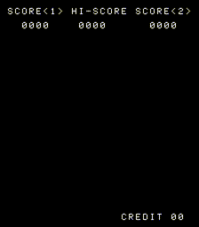

# Space Invaders Emulator

My emulator of the original [Space Invaders arcade machine](https://en.wikipedia.org/wiki/Space_Invaders#Hardware), written in C++ and using SDL2 for display and buttons. It includes a complete emulator of the Intel 8080 CPU, which has been tested against [kpmiller's reference implementation](https://github.com/kpmiller/emulator101/blob/master/CocoaPart7-Threading/8080emu.c). It can also play other games on the same hardware such as variations like [Alien Invasion](http://adb.arcadeitalia.net/dettaglio_mame.php?game_name=alieninv&search_id=) and [Space Attack II](https://www.arcade-museum.com/game_detail.php?game_id=9639), but only the original Space Invaders game has been thoroughly tested.

## References used in development

- Intel 8080 Assembly Language Programming Manual
- [ComputerArcheology.com](https://computerarcheology.com/Arcade/SpaceInvaders/Hardware.html)
- [Emulator101.com](http://www.emulator101.com/)

## Requirements

- For copyright reasons I can not provide the ROM file for the space invaders game. **You need to find and download the ROM file yourself and place it in the same directory as the executable.** The ROM can either be provided as one file (`invaders.bin`) or as four separate files (`invaders.e`, `invaders.f`, `invaders.g` and `invaders.h`).
- gcc
- SDL 2

## Usage

Once you have made sure that you have ROM file and SDL2, type `make run` into your favorite console to compile and run.

## Controls

Player 1 plays with the arrow keys and Player 2 with WASD.

| **Key**     | **Function**                          |
|------------:|--------------------------------------:|
| Enter       | Insert coin                           |
| 1           | Select 1 Player mode                  |
| 2           | Select 2 Player mode                  |
| 🠉           | fire       (Player 1)                 |
| 🠈           | move left  (Player 1)                 |
| 🠊           | move right (Player 1)                 |
| W           | fire       (Player 2)                 |
| A           | move left  (Player 2)                 |
| D           | move right (Player 2)                 |
